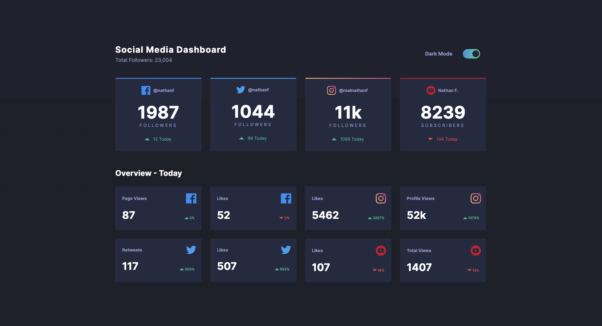
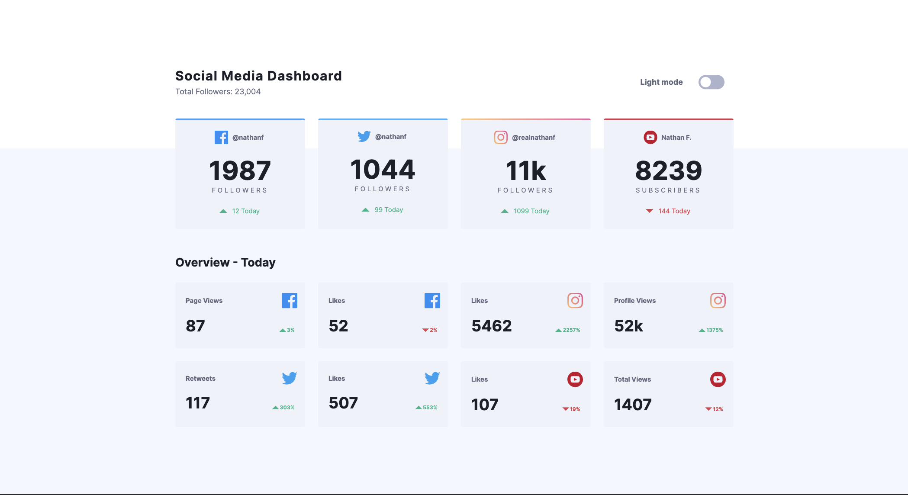

This is a solution to the Social Media dashboard component

## Table of contents

- [Overview](#overview)
  - [Screenshot](#screenshot)
  - [Links](#links)
- [My process](#my-process)
  - [Built with](#built-with)
  - [What I learned](#what-i-learned)
  - [Continued development](#continued-development)
- [Author](#author)

## Overview

Responsive Social Media Dashboard with dark/light color scheme.

### Screenshot

#### Dark mode

#### Light mode

### Links

- Live Site URL: https://social-media-dashboard-nadiafr.netlify.app/

## My process

### Built with

- Semantic HTML5 markup
- SASS architecture (sass variables, @mixins ..)
- Flexbox, responsive Grid
- Hover effect on media blocks
- Changing color scheme using JS

### What I learned

- SASS architecture for little card projects
- How to make page responsive using only Grid

### Continued development

JavaScript. I'm prety sure my js code could be minimized a lot.

## Author

Nadia Furzikova - front-end developer,
based 📍 Nancy/France
